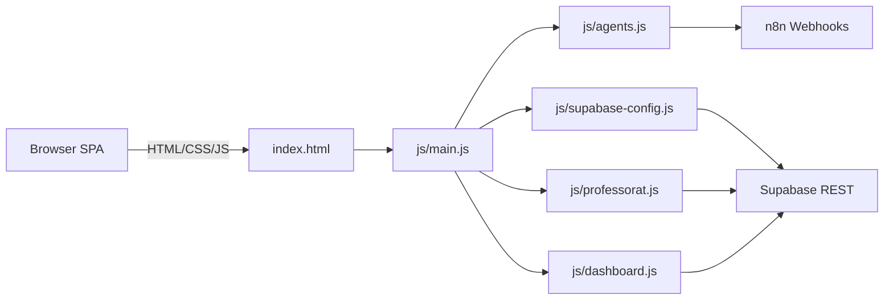
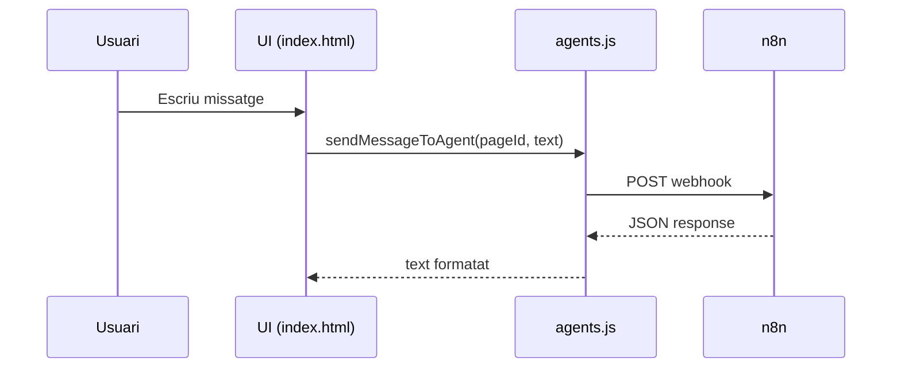
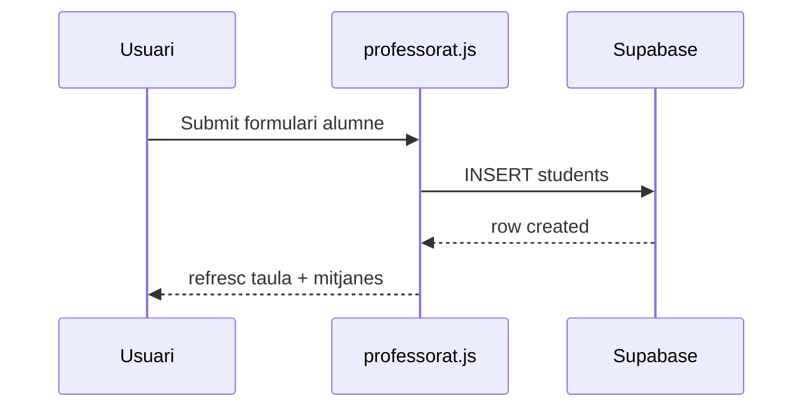

# TDR_web - Documentacio tecnica i d'usuari

Projecte de Treball de Recerca (TDR) centrat en automatitzacions amb IA per a la gestio educativa. La solucio es una SPA estatica amb tres agents (professors, families/alumnes i directius) i un dashboard de dades academiques alimentat per Supabase.

---

## 1. Guia d'usuari

### 1.1 Agent Professors
**Objectiu:** gestionar classes, alumnes, notes (grades), excursions i deures.

**Flux principal:**
1) Seleccionar o crear una classe.
2) Afegir alumnes i gestionar el seu estat (actiu/inactiu).
3) Obrir la seccio de notes per registrar qualificacions i veure historial.
4) Crear excursions i registrar assistencia/pagaments per alumne.
5) Crear deures i marcar entregues per alumne.

**Punts clau de la UI:**
- Selector de classe i botons de creacio/eliminacio.
- Pestanyes: `Classes i Registres` i `Alumnes i Notes`.
- Subpestanyes: `Excursions` i `Deures`.
- Cerca global d'alumnes per obrir notes directament.

### 1.2 Agent Families i Alumnes
**Objectiu:** canal de consulta via xat.

**Flux principal:**
- Escriure una pregunta al xat i rebre resposta del workflow n8n corresponent.

### 1.3 Agent Directius
**Objectiu:** obtenir indicadors academics agregats i tendencies.

**Funcionalitats:**
- KPIs principals (total alumnes, mitjana global, percentatge d'aprovats, tendencia trimestral).
- Grafics per assignatura, nivell i tendencia per trimestre.
- Filtres per curs, nivell i grup.
- Resum de conclusions en format "chips".

---

## 2. Arquitectura tecnica

### 2.1 Components principals
| Component | Rol | Fitxer |
| --- | --- | --- |
| Shell SPA | Contenidor de la UI i navegacio per hash | `index.html` |
| Estils globals | Tema clar/fosc, components, layout | `css/styles.css` |
| Router i tema | Navegacio, header i init per pagina | `js/main.js` |
| Chat | Enviament de missatges a n8n | `js/agents.js` |
| Supabase client | Inicialitzacio del client | `js/supabase-config.js` |
| Modul Professorat | CRUD de classes, alumnes, notes, excursions, deures | `js/professorat.js` |
| Modul Dashboard | Agregacions i graficat per directius | `js/dashboard.js` |

### 2.2 Flux d'execucio (resum)
1) `index.html` carrega estils i scripts.
2) `main.js` inicialitza tema, navegacio i gestio de pestanyes.
3) `supabase-config.js` crea `window.supabaseClient`.
4) En entrar a cada pagina, `main.js` invoca el modul corresponent.
5) Les accions de l'usuari disparen crides a Supabase (CRUD) o n8n (chat).

### 2.3 Diagrames

**Arquitectura general (navegacio + dades)**

**Flux de chat per agent**

**Flux CRUD Professorat (exemple alumnes)**

---

## 3. Dades i model

### 3.1 Supabase (migracions)
Els scripts SQL resideixen al root del projecte:
- `supabase_migration.sql` (taules base de professorat)
- `supabase_rls_setup.sql` (politica RLS)
- `supabase_update_notes_to_grades.sql` (evolucio de notes a grades)

### 3.2 Esquema Professorat (resum)
**Taules:**
- `classes`: classes del centre.
- `students`: alumnes associats a una classe.
- `grades`: qualificacions (exam, homework, activity, etc.).
- `excursions` + `excursion_status`: excursions i estat per alumne.
- `homeworks` + `homework_status`: deures i estat per alumne.

Relacions clau:
- `students.class_id -> classes.id`
- `grades.student_id -> students.id`
- `excursions.class_id -> classes.id`
- `excursion_status.excursion_id -> excursions.id`
- `excursion_status.student_id -> students.id`
- `homeworks.class_id -> classes.id`
- `homework_status.homework_id -> homeworks.id`
- `homework_status.student_id -> students.id`

### 3.3 Taula de dades academiques (dashboard)
El dashboard llegeix una taula academica configurada al client (nom intern a `js/dashboard.js`). Columnes esperades:
- Identificadors i context: `id`, `curs_academic`, `nivell`, `grup`, `alumne_id`, `alumne_nom`, `trimestre`.
- Notes: `nota_catala`, `nota_castella`, `nota_matematiques`, `nota_angles`, `nota_socials`, `nota_naturals`.
- Control temporal: `created_at`.

---

## 4. Modul Professorat (detall)

### 4.1 Estat i inicialitzacio
- Estat global a `ProfessoratState` amb caches de classes, alumnes, grades, excursions i deures.
- Inicialitzacio segura via `safeInitProfessorat()` per evitar duplicats.
- Persistencia de classe seleccionada a `localStorage`.

### 4.2 CRUD de classes
- `loadClasses()` carrega classes i actualitza selectors.
- `createClass()` inserta registre i recarrega estat.
- `performDeleteClass()` elimina i neteja estat local.

### 4.3 CRUD d'alumnes
- `loadStudents(classId)` carrega alumnes per classe.
- `handleCreateStudent()` valida, inserta i actualitza taula.
- `updateStudent()` edita camps basics.
- `toggleStudentActive()` canvia `is_active`.

### 4.4 Notes (grades)
- `loadGrades(studentId)` llegeix historial.
- `handleCreateGrade()` crea o edita segons `editingGradeId`.
- Mitjana ponderada per criteris:
  - `exam`: 80%
  - `homework`: 10%
  - `activity`: 10%

### 4.5 Excursions
- `loadExcursions(classId)` llista excursions.
- `handleCreateExcursion()` crea excursio i genera `excursion_status` per alumne.
- `loadExcursionDetail()` carrega taula d'assistencia i pagaments.
- `updateExcursionStatus()` actualitza o crea registre per alumne.

### 4.6 Deures
- `loadHomeworks(classId)` llista deures.
- `handleCreateHomework()` crea deure i genera `homework_status` per alumne.
- `loadHomeworkDetail()` carrega taula d'entregues.
- `updateHomeworkStatus()` actualitza o crea registre per alumne.

---

## 5. Modul Dashboard Directius

### 5.1 Dades i filtres
- Carrega massiva des de Supabase.
- Filtres per `curs_academic`, `nivell`, `grup`.

### 5.2 Metrics calculades
- Total d'alumnes (unics per alumne).
- Mitjana global (mitjana de mitjanes per alumne).
- Percentatge d'aprovats (>= 5).
- Tendencia trimestral (delta entre els dos ultims trimestres disponibles).
- Mitjanes per assignatura i per nivell.

### 5.3 Grafics (Chart.js)
- Barres verticals per assignatura.
- Línia per tendencia trimestral.
- Barres horitzontals per nivell.

---

## 6. Modul Chat (agents)

### 6.1 Funcionament
- Cada pagina te el seu context de chat.
- `agents.js` tradueix el `pageId` a nom d'agent i envia el missatge al webhook configurat.
- Suport de respostes en formats diversos (`output`, `response`, `message`, etc.).

### 6.2 Render de missatges
- Markdown renderitzat amb `marked` per a respostes del bot.
- Missatges d'usuari i bot amb estils diferenciats.

---

## 7. UI i estil

### 7.1 Tema
- Mode clar/fosc controlat per `body.dark-mode`.
- Toggle persistent via `localStorage`.

### 7.2 Interaccio
- Sense animacions de posicio al hover (nomes canvis de color/ombra).
- Scroll preservat en canvis de pestanya per evitar salts.

---

## 8. Notes metodologiques del TDR
- El disseny prioritza un prototip funcional, modular i demostrable.
- L'automatitzacio per agents s'aillla en webhooks per poder substituir IA o proveidors sense tocar la UI.
- Les dades academiques es concentren en una taula agregada per optimitzar la visualitzacio per directius.
